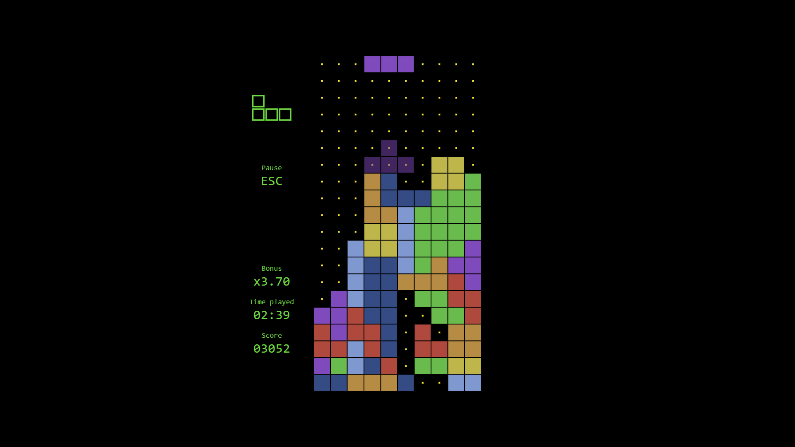
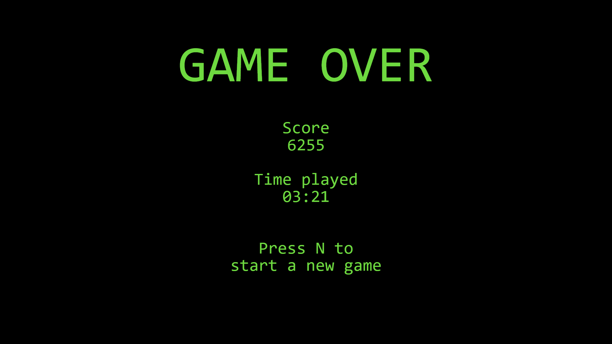

# TetrisHS
Clon de Tetris desarrollado en Haskell utilizando CodeWorld, con soporte para áreas de juego de diferentes dimensiones.
Realizado por Enrique Fernández Corrales y Alan Trawczynski, como trabajo para la asignatura PD 2020/2021.


## Instalación
1. Instalar las [dependencias](##Dependencias).
2. Clonar el repositorio:
    ```
    git clone https://github.com/AlanTrawczynski/TetrisHS.git
    ```
3. Definir una función *main* utilizando alguna de las [funciones exportadas por *Tetris.hs*](###Funciones-exportadas-por-Tetris.hs), mediante *Main.hs* u otro archivo.
4. Compilar el archivo:
    ```
    ghc -threaded nombre-del-archivo
    ```
5. Ejecutar y abrir la ruta `localhost:3000` en el navegador.

## Dependencias
| Librería/módulo | Comando                                     |
| ---------------:|---------------------------------------------|
| CodeWorld       | cabal install codeworld-api                 |
| Data.Matrix     | cabal install matrix                        |

## Uso
### Funciones exportadas por *Tetris.hs*
Existen ejemplos de uso mínimos en *Main.hs*. Las funciones para iniciar el juego son:
- ***runTetris***: área de juego clásica, matrix 20 filas x 10 columnas.
- ***runCustomTetris***: área de juego personalizada, indicando el número de filas y columnas como parámetros en la llamada a la función.
- ***runCustomTetrisInteractive***: área de juego personalizada, indicando el número de filas y columnas mediante un asistente por consola.
### Controles
- Durante la pantalla de **juego**:
    
    | Tecla | Acción                                      |
    | -----:|---------------------------------------------|
    | Esc   | Pausar el juego (ir a la pantalla de pausa) |
    | ←     | Mover la pieza hacia la izquierda           |
    | →     | Mover la pieza hacia la derecha             |
    | ↓     | Mover la pieza una fila hacia abajo         |
    | ↑     | Rotar la pieza en sentido horario           |
    | Z     | Rotar la pieza en sentido antihorario       |
    | C     | *Hard drop* (hacer caer la pieza)           |
- Durante la pantalla de **pausa**:
    
    | Tecla | Acción                                      |
    | -----:|---------------------------------------------|
    | Esc   | Volver al juego                             |
    | N     | Abortar partida actual y comenzar una nueva |
- Durante la pantalla de ***Game Over***:
    
    | Tecla | Acción                                      |
    | -----:|---------------------------------------------|
    | N     | Comenzar una nueva partida                  |
