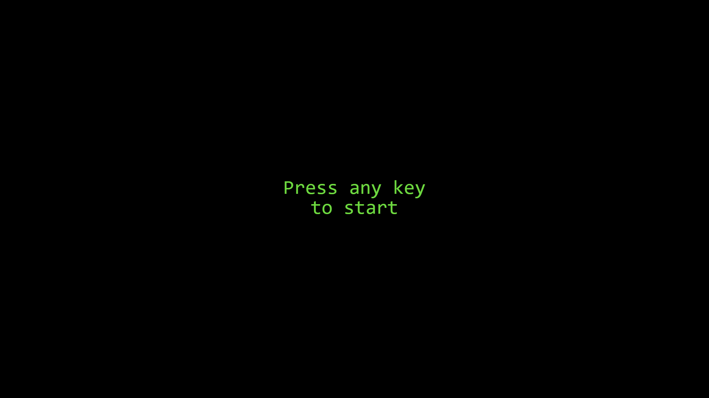
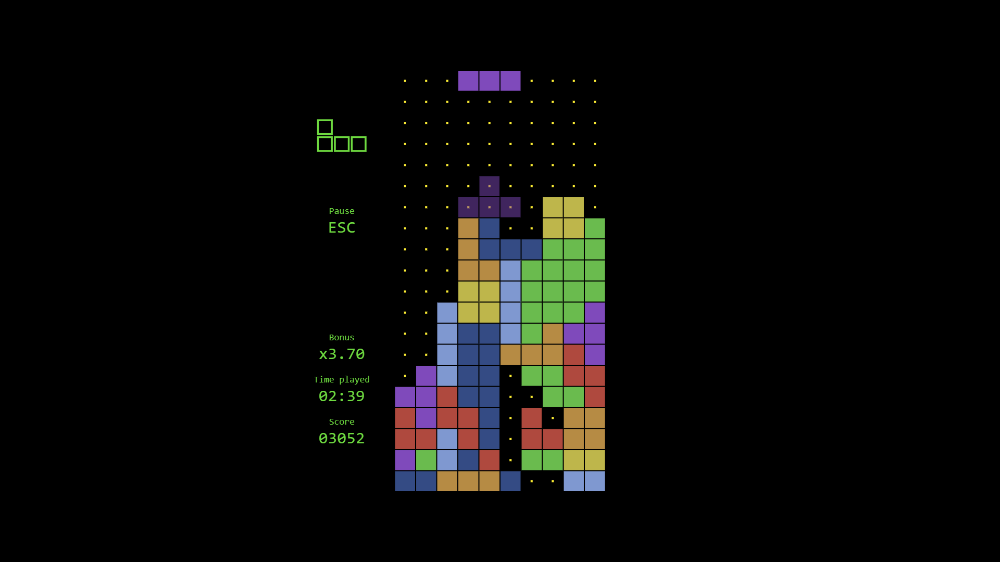
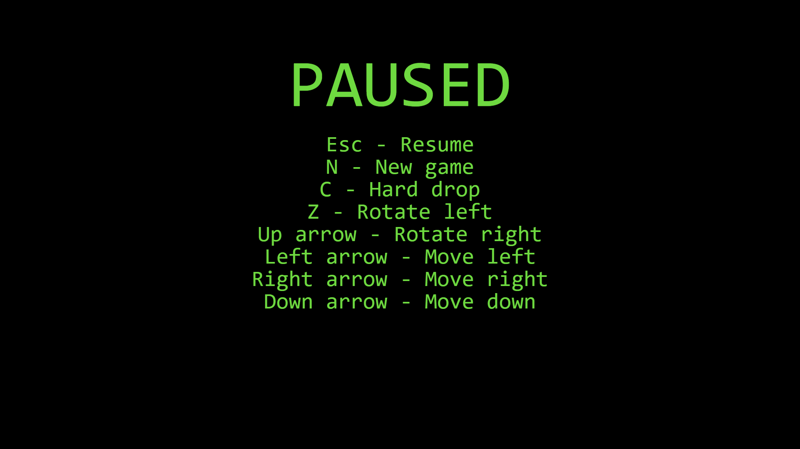
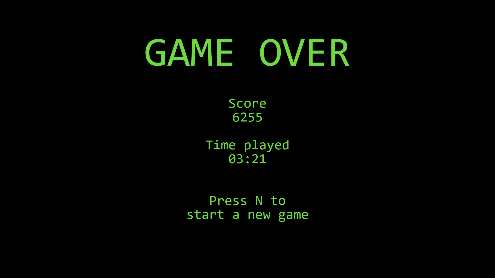

# Memoria de trabajo: TetrisHS
## Índice
1. [Autores](#autores)
2. [Temática](#temática)
3. [Estructura](#estructura)
4. [Requisitos](#requisitos)
    1. [Funciones de Prelude](#funciones-de-prelude)
    2. [Funciones de Data.List](#funciones-de-datalist) 
    3. [Funciones recursivas](#funciones-recursivas)
    4. [Funciones por patrones](#funciones-por-patrones)
    5. [Funciones con guardas](#funciones-con-guardas)
    6. [Funciones con case of](#funciones-con-case-of)
    7. [Funciones con listas por comprensión](#funciones-con-listas-por-comprensión)
    8. [Funciones con orden superior](#funciones-con-orden-superior)
    9. [Funciones con evaluación perezosa](#funciones-con-evaluación-perezosa)
    10. [Módulo](#módulo)
    11. [Tipos de datos nuevos](#tipos-de-datos-nuevos)
    12. [Tipos de datos abstractos o librerías](#tipos-de-datos-abstractos-o-librerías)
5. [Compilación](#compilación)
6. [Uso](#uso)
    1. [Pantallas](#pantallas)
    2. [Controles](#controles)
7. [Librerías](#librerías)

## Autores
| Nombre    | Apellidos             | UVUS      | Correo                    |
| ---------:|-----------------------|-----------|---------------------------|
| Alan      | Trawczynski           | alatra    | alantrawcz@gmail.com      |
| Enrique   | Fernández Corrales    | enrfercor | enrique.fdezco@gmail.com  |

## Temática
La temática escogida para el trabajo ha sido el desarrollo de un clon del famoso juego Tetris. Aunque las decisiones de los diferentes aspectos del juego se hayan ido tomando a lo largo de la implmentación, podemos destacar las siguientes características:
- Sistema de rotación [*SRS*](https://tetris.fandom.com/wiki/SRS) en ambas direcciones.
- Evasión de [*wall kicks*](https://tetris.fandom.com/wiki/Wall_kick) mediante el desplazamiento de la pieza rotada hacia ambas direcciones un máximo de 2 columnas, manteniéndola siempre en la misma fila.
- Sistema de generación de figuras evitando la repetición de las mismas.
- Representación del área de juego mediante una matriz de colores.
- Representación de figuras mediante una lista de puntos y una etiqueta para identificar su tipo.
- Aparición de figuras por encima del área de juego.
- Representación de la [*figura fantasma*](https://tetris.fandom.com/wiki/Ghost_piece).
- Implementación del [*hard drop*](https://tetris.fandom.com/wiki/Hard_Drop).
- Soporte de diferentes dimensiones del área de juego (mínimo 5x5).

Para más información acerca de algunos de los puntos anteriores visitar [este enlace](https://app.milanote.com/1KLcZF1R2gRM3O?p=5xIkFFEEeKv), donde pueden encontrarse diferentes diagramas y descripciones que nos han servido a lo largo del desarrollo.

## Estructura
Todo el código se encuentra en un único archivo, el módulo Tetris, que exporta las funciones *runTetris*, *runCustomTetris* y *runCustomTetrisInteractive*. Podemos diferenciar ocho partes:

1. **IO**: es el punto de partida para interactuar con el módulo, define las funciones exportadas, así como otras utilizadas internamente de tipo *IO*.
    ```
    runTetris :: IO ()
    runCustomTetris :: Int -> Int -> IO ()
    runCustomTetrisInteractive :: IO ()
    generateRandoms :: IO FigureGenerator
    getMinNum :: String -> Int -> IO Int
    ```
2. **Types**: define todos los tipos de datos que se utilizan posteriormente.
    ```
    data Tetris = Tetris {...}
    type FigureGenerator = [Int]
    type Figure = ([Point], FigureType)
    type FigureType = Char
    type Playfield = Matrix Color
    type Time = Double
    type DefaultClock = Double
    type Clock = Double
    type Score = Int
    data State = Start | Normal | Pause | GameOver
    data Direction = L | R
    ```
3. **Init**: define las funciones necesarias para iniciar el juego, tanto por primera vez como para las partidas posteriores.
    ```
    startTetris :: FigureGenerator -> Int -> Int -> Tetris
    initTetris :: FigureGenerator -> Int -> Int -> Tetris
    newGame :: Tetris -> Tetris
    ```
4. **Events**: define los manejadores de eventos utilizados por *CodeWorld* que modificarán el estado de *Tetris* y permitirán el avance del juego.
    ```
    manageEvent :: Event -> Tetris -> Tetris
    manageStart :: Event -> Tetris -> Tetris
    manageNormal :: Event -> Tetris -> Tetris
    managePause :: Event -> Tetris -> Tetris
    manageGameover :: Event -> Tetris -> Tetris
    ```
5. **Draw**: define las funciones de dibujado utilizados por *CodeWorld* encargadas de representar gráficamente el estado de *Tetris*.
    ```
    screenWidth, screenHeight :: Double
    drawTetris :: Tetris -> Picture
    drawStart :: Tetris -> Picture
    drawNormal :: Tetris -> Picture
    drawFigure :: Figure -> Playfield -> Picture
    drawPlayfield :: Playfield -> Picture
    drawSquare :: Point -> Color -> Picture
    drawPoint :: Point -> Picture
    drawStats :: Tetris -> Picture
    drawStatsLeft, drawStatsDown :: [Picture] -> Double -> Picture
    drawStat :: String -> String -> Picture
    drawNextFigure :: FigureGenerator -> Picture
    drawPause :: Tetris -> Picture
    drawControl :: Picture
    drawGameOver :: Tetris -> Picture
    drawTitle :: String -> Picture
    drawTextLines :: [String] -> Picture
    stringPic :: String -> Picture
    ```
6. **Color & format**: define funciones que definen el color y formato utilizado en el dibuajdo.
    ```
    figuretypeColor :: FigureType -> Color
    pointColor :: Color
    formatScore :: Score -> String
    formatTime :: Time -> String
    formatBonus :: DefaultClock -> String
    ```
7. **Tetris**: define funciones y operadores encargados de interactuar con los diferentes atributos que conforman *Tetris*. Modifica los estados del juego, procesa los movimientos de la figura actual, elimina filas llenas, comprueba si el juego ha acabado, etc.
    ```
    (!.) :: Playfield -> Point -> Color
    setElem' :: Color -> Point -> Playfield -> Playfield
    validPosition :: Figure -> Playfield -> Bool
    updatePlayfield :: Playfield -> Figure -> (Playfield, Int)
    removeFullRows :: Playfield -> (Playfield, Int)
    newRows :: Int -> Int -> Playfield
    fullRows :: Playfield -> [Int]
    removeRows :: [Int] -> Playfield -> Playfield
    moveDown :: Tetris -> Tetris
    hardDrop :: Tetris -> Tetris
    placeFigure :: Tetris -> Tetris
    isGameOver :: Figure -> Playfield -> Bool
    moveLeft :: Tetris -> Tetris
    moveRight :: Tetris -> Tetris
    moveFigure :: Figure -> Double -> Double -> Figure
    ```
8. **Figure**: define las funciones encargadas de la generación y rotación de figuras, así como el cálculo de las sombra de una figura.
    ```
    nextFigure :: FigureGenerator -> Playfield -> (Figure, FigureGenerator)
    nextFgen :: FigureGenerator -> (Int, FigureGenerator)
    generateFigure :: Int -> Playfield -> Figure
    spawnFigure :: Int -> Figure
    tryRotateFigureRight, tryRotateFigureLeft :: Tetris -> Tetris
    tryRotateFigure :: Tetris -> Direction -> Tetris
    rotateFigure :: Figure -> Direction -> Figure
    rotatePoints :: Point -> [Point] -> Direction -> [Point]
    shadowFigure :: Figure -> Playfield -> Figure
    ```

## Requisitos
### Funciones de Prelude
En la mayoría de funciones definidas se utilizan funciones de Prelude, pondremos de ejemplo solamente algunas de ellas:
1. generateFigure: `map`, `even`, `fromIntegral`, `($)`.
  ```
  generateFigure n pf = (ps', ft)
    where ps' = map (\(x, y) -> (x+dx, y+dy)) ps
          (ps, ft) = spawnFigure n
          dx  | even nc                 = nc'/2
              | ft == 'I' || ft == 'O'  = nc'/2 - 0.5
              | otherwise               = nc'/2 + 0.5
          dy = nr' + 1
          nc = ncols pf
          nc' = fromIntegral nc
          nr' = fromIntegral $ nrows pf
  ```
2. formatTime: `divMod`, `floor`.
  ```
  formatTime t = printf "%02d:%02d" m s
    where (m, s) = divMod (floor t) 60 :: (Int, Int)
  ```
3. removeRows: `zip`, `notElem`.
  ```
  removeRows [] pf = pf
  removeRows toRemove pf = fromLists [row | (i,row) <- zip [1..nr] pfList, notElem i toRemove]
    where nr = nrows pf
          pfList = toLists pf
  ```
4. removeFullRows: `length`, `null`.
  ```
  removeFullRows pf
    | null is   = (pf,[])
    | otherwise = (newRows toAdd nc <-> removeRows is pf, is)
    where is = fullRows pf
          toAdd = length is
          nc = ncols pf
  ```
### Funciones de Data.List
1. fullRows: `findIndices`.
  ```
  fullRows pf = map (+1) (findIndices p (toLists pf))
    where p = all (/= black)
  ```
2. drawTextLines: `genericLength`.
  ```
  drawTextLines ls = pictures [translated 0 y (stringPic l) | (l, y) <- zip ls [n, n-1..]]
    where n = (genericLength ls)/2 - 0.5
  ```
### Funciones recursivas
1. updatePlayfield.
```
updatePlayfield pf ([], _)    = removeFullRows pf
updatePlayfield pf (p:ps, ft) = updatePlayfield pf' (ps, ft)
  where pf' = setElem' c p pf
        c = figuretypeColor ft
```
2. validPosition.
```
validPosition ([], _) _ = True
validPosition ((x,y):ps, ft) pf = doesNotExceed && doesNotCollide && validPosition (ps, ft) pf
  where doesNotCollide = y > nr' || pf !. (x,y) == black
        doesNotExceed = x >= 1 && x <= nc' && y >= 1
        nr' = fromIntegral $ nrows pf
        nc' = fromIntegral $ ncols pf
```
3. move en moveFigure.
```
moveFigure (ps, ft) dx dy = (move ps, ft)
  where move [] = []
        move ((x,y):r) = (x+dx, y+dy):(move r)
```
### Funciones por patrones
1. manageStart.
```
manageStart (KeyRelease _) tetris = tetris {st = Normal}
manageStart _ tetris = tetris
```
2. managePause.
```
managePause (KeyRelease "Esc") tetris = tetris {st = Normal}
managePause (KeyRelease "N") tetris = newGame tetris
managePause _ tetris = tetris
```
3. manageGameover.
```
manageGameover (KeyRelease "N") tetris = newGame tetris
manageGameover _ tetris = tetris
```
4. removeRows.
```
removeRows [] pf = pf
removeRows toRemove pf = fromLists [row | (i,row) <- zip [1..nr] pfList, notElem i toRemove]
  where nr = nrows pf
        pfList = toLists pf
```
5. safeHead.
```
safeHead:: [a] -> Maybe a
safeHead [] = Nothing
safeHead l = Just $ head l
```
### Funciones con guardas
1. moveDown.
```
moveDown tetris
  | validPosition mf pf_  = tetris {f = mf, clk = dclk tetris}
  | isGameOver f_ pf_     = tetris {st = GameOver}
  | otherwise             = placeFigure tetris
  where mf = moveFigure f_ 0 (-1)posición hacia abajo.
        pf_ = pf tetris
        f_ = f tetris
```
2. hardDrop.
```
hardDrop tetris
  | isGameOver f' pf_ = tetris {st = GameOver}
  | otherwise         = placeFigure $ tetris {f = f'}
  where f' = shadowFigure (f tetris) pf_
        pf_ = pf tetris
```
3. moveLeft.
```
moveLeft tetris
  | validPosition mf (pf tetris) = tetris {f = mf}
  | otherwise = tetris
  where mf = moveFigure (f tetris) (-1) 0
```
4. moveRight.
```
moveRight tetris
  | validPosition mf (pf tetris) = tetris {f = mf}
  | otherwise = tetris
  where mf = moveFigure (f tetris) 1 0
```
5. nextFgen.
```
nextFgen (current:next:next2:rest)
  | current /= next = (next, next:rest)
  | otherwise       = (next2, next2:rest)
```
### Funciones con case of
1. manageEvent.
```
manageEvent event tetris = manager event tetris
  where manager = case st tetris of
                    Start     -> manageStart
                    Normal    -> manageNormal
                    Pause     -> managePause
                    GameOver  -> manageGameover
```
2. manageNormal.
```
manageNormal (TimePassing dt) tetris
  | clk tetris < 0  = moveDown tetris
  | otherwise       = tetris {t = (t tetris)+dt, clk = (clk tetris)-dt}
manageNormal (KeyRelease k) tetris = case k of
  "Esc" -> tetris {st = Pause}
  "C"   -> hardDrop tetris
  _     -> tetris
manageNormal (KeyPress k) tetris = case k of
  "Up"    -> tryRotateFigureRight tetris
  "Z"     -> tryRotateFigureLeft tetris
  "Down"  -> moveDown tetris
  "Left"  -> moveLeft tetris
  "Right" -> moveRight tetris
  _       -> tetris
manageNormal _ tetris = tetris
```
3. drawTetris.
```
drawTetris tetris = draw tetris & bg
  where bg = solidRectangle screenWidth screenHeight
        draw = case st tetris of
                Start     -> drawStart
                Normal    -> drawNormal
                Pause     -> drawPause
                GameOver  -> drawGameOver
```
4. figuretypeColor.
```
figuretypeColor ft = dull $ case ft of
  'O' -> yellow
  'I' -> light blue
  'L' -> orange
  'J' -> blue
  'S' -> red
  'Z' -> green
  'T' -> purple
```
5. spawnFigure.
```
spawnFigure n = case n of
  1 -> ([(0,1),   (1,1),    (0,2),    (1,2)],   'O')
  2 -> ([(-1,1),  (0,1),    (1,1),    (2,1)],   'I')
  3 -> ([(0,1),   (-1,1),   (1,1),    (1,2)],   'L')
  4 -> ([(0,1),   (-1,1),   (1,1),    (-1,2)],  'J')
  5 -> ([(0,1),   (-1,1),   (0,2),    (1,2)],   'S')
  6 -> ([(0,1),   (1,1),    (-1,2),   (0,2)],   'Z')
  7 -> ([(0,1),   (-1,1),   (1,1),    (0,2)],   'T')
```
6. tryRotateFigure.
```
tryRotateFigure tetris dir = case maybef' of
  Nothing -> tetris
  Just f' -> tetris {f = f'}
  where maybef' = safeHead $ filter (\f -> validPosition f (pf tetris)) (map ($rf) mvs)
        rf = rotateFigure (f tetris) dir
        mvs = [ \x -> moveFigure x 0    0,
                \x -> moveFigure x 1    0,
                \x -> moveFigure x (-1) 0,
                \x -> moveFigure x 2    0,
                \x -> moveFigure x (-2) 0]
```
7. rotateFigure.
```
rotateFigure (ps, ft) dir = case ft of
  'O' -> (ps, ft)
  'I' -> (ps', ft)
    where ps' = rotatePoints center ps dir
          [_,(x1,y1),(x2,y2),_] = ps
          center  | x1 < x2 = ((x1+x2)/2, y1-0.5)
                  | x1 > x2 = ((x1+x2)/2, y1+0.5)
                  | y1 > y2 = (x1-0.5, (y1+y2)/2)
                  | y1 < y2 = (x1+0.5, (y1+y2)/2)
  ft   -> (ps', ft)
    where ps' = center:(rotatePoints center rest dir)
          (center:rest) = ps
```
8. rotatePoints.
```
rotatePoints center ps dir = map (rotate center) ps
  where rotate (xo,yo) (xi,yi) = case dir of
          R -> (yi-yo+xo, -(xi-xo)+yo)
          L -> (-(yi-yo)+xo, xi-xo+yo)
```
### Funciones con listas por comprensión
1. drawPlayfield.
```
drawPlayfield pf = pictures [if c /= black then drawSquare p c else drawPoint p |
                            row <- [1..nrows pf],
                            col <- [1..ncols pf],
                            let p = (fromIntegral col, fromIntegral row),
                            let c = pf !. p]
```
2. drawTextLines.
```
drawTextLines ls = pictures [translated 0 y (stringPic l) | (l, y) <- zip ls [n, n-1..]]
  where n = (genericLength ls)/2 - 0.5
```
3. removeFullRows.
```
removeFullRows pf
  | null is   = (pf,0)
  | otherwise = (newRows toAdd nc <-> removeRows is pf, toAdd)
  where is = fullRows pf
        toAdd = length is
        nc = ncols pf
```
4. removeRows.
```
removeRows [] pf = pf
removeRows toRemove pf = fromLists [row | (i,row) <- zip [1..nr] pfList, notElem i toRemove]
  where nr = nrows pf
        pfList = toLists pf
```
5. shadowFigure.
```
shadowFigure (ps,t) pf = (sps,t)
  where sps = map (\(x,y) -> (x, y-yDif+1)) ps
        yDif = minimum [y - maxNotEmptyRow |
                        (x,y) <- ps,
                        let ys2 = [ y2 |
                                    y2 <- [y, y-1..1],
                                    y2 <= nr',
                                    pf !. (x,y2) /= black],
                        let maxNotEmptyRow = if null ys2 then 0 else head ys2]
        nr' = fromIntegral $ nrows pf
```
### Funciones con orden superior
1. drawFigure: `foldr`.
```
drawFigure f@(ps, ft) pf = draw ps c & draw sps (translucent c)
  where c = figuretypeColor ft
        (sps, _) = shadowFigure f pf
        draw ps c = pictures $ foldr f [] ps
          where nr' = fromIntegral $ nrows pf
                f (x,y) ac  | y <= nr'  = (drawSquare (x,y) c):ac
                            | otherwise = ac
```
2. drawNextFigure: `map`.
```
drawNextFigure fgen = colored green (translated dx dy (pictures $ map draw ps))
  where draw (x,y) = translated x y (thickRectangle 0.11 0.82 0.82)
        (ps, ft) = spawnFigure $ fst $ nextFgen fgen
        (dx, dy) = case ft of
                    'I' -> (-0.5, -0.5)
                    'O' -> (-0.5, -1)
                    _   -> (0, -1)
```
3. fullRows: `map`.
```
fullRows pf = map (+1) (findIndices p (toLists pf))
  where p = all (/= black)
```
4. generateFigure: `map`.
```
generateFigure n pf = (ps', ft)
  where ps' = map (\(x, y) -> (x+dx, y+dy)) ps
        (ps, ft) = spawnFigure n
        dx  | even nc                 = nc'/2
            | ft == 'I' || ft == 'O'  = nc'/2 - 0.5
            | otherwise               = nc'/2 + 0.5
        dy = nr' + 1
        nc = ncols pf
        nc' = fromIntegral nc
        nr' = fromIntegral $ nrows pf
```
5. shadowFigure: `map`.
```
shadowFigure (ps,t) pf = (sps,t)
  where sps = map (\(x,y) -> (x, y-yDif+1)) ps
        yDif = minimum [y - maxNotEmptyRow |
                        (x,y) <- ps,
                        let ys2 = [ y2 |
                                    y2 <- [y, y-1..1],
                                    y2 <= nr',
                                    pf !. (x,y2) /= black],
                        let maxNotEmptyRow = if null ys2 then 0 else head ys2]
        nr' = fromIntegral $ nrows pf
```

6. tryRotateFigure: `filter`.
```
tryRotateFigure tetris dir = case maybef' of
  Nothing -> tetris
  Just f' -> tetris {f = f'}
  where maybef' = safeHead $ filter (\f -> validPosition f (pf tetris)) (map ($rf) mvs)
        rf = rotateFigure (f tetris) dir
        mvs = [ \x -> moveFigure x 0    0,
                \x -> moveFigure x 1    0,
                \x -> moveFigure x (-1) 0,
                \x -> moveFigure x 2    0,
                \x -> moveFigure x (-2) 0]
```
### Funciones con evaluación perezosa
1. **FigureGenerator**: este tipo y las funciones que hacen uso de él son el ejemplo más claro de evaluación perezosa, puesto que se encarga de almacenar una lista infinita de números enteros. En caso de que Haskell realizara una evaluación impaciente de los parámetros, el procesamiento de la lista infinita nunca acabaría.
```
type FigureGenerator = [Int]

nextFgen :: FigureGenerator -> (Int, FigureGenerator)
nextFgen (current:next:next2:rest)
  | current /= next = (next, next:rest)
  | otherwise       = (next2, next2:rest)
```
2. **isGameOver**: la operación que realiza `map` sobre la lista `ps` no es evaluada hasta que el valor sea requerido por la función `any`, de esta forma evitaremos el procesamiento de aquellos elementos de `ps` posteriores al primero que cumpla el predicado `>ceil`.
```
isGameOver (ps, _) pf = any (>ceil) (map snd ps)
  where ceil = fromIntegral $ nrows pf
```
3. **tryRotateFigure**: el papel que juega la evaluación perezosa en esta función es similar al visto en *isGameOver*, pero más complejo. Se realizarán los cálculos necesarios únicamente hasta encontrar el primer elemento (resultante de aplicar `map`) que no sea filtrado por la función `filter`.
```
tryRotateFigure tetris dir = case maybef' of
  Nothing -> tetris
  Just f' -> tetris {f = f'}
  where maybef' = safeHead $ filter (\f -> validPosition f (pf tetris)) (map ($rf) mvs)
        rf = rotateFigure (f tetris) dir
        mvs = [ \x -> moveFigure x 0    0,
                \x -> moveFigure x 1    0,
                \x -> moveFigure x (-1) 0,
                \x -> moveFigure x 2    0,
                \x -> moveFigure x (-2) 0]
```
### Módulo
El archivo *Tetris.hs* constituye un módulo que exporta las tres funciones (*runTetris*, *runCustomTetris*, *runCustomTetrisInteractive*) que nos permiten interactuar con el juego:
- **runTetris**: nos permite ejecutar la versión clásica, con un área de juego 20x10 (filas x columnas).
- **runCustomTetris**: nos permite ejecutar una versión personalizada, con un área de juego de cualquier dimensión mayor que 5x5. El número de filas y columnas se pasan como parámetros a la función.
- **runCustomTetrisInteractive**: cumple el mismo objetivo que *runCustomTetris*, con la diferencia de que la introducción del número de filas y columnas se realiza de forma interactiva mediante la consola.
### Tipos de datos nuevos
1. **Tetris**: tipo *data* con sintaxis de registro utilizado para representar las diferentes atributos utilizados en el juego.
```
data Tetris =
  Tetris {
    fgen  ::  FigureGenerator,
    f     ::  Figure,
    pf    ::  Playfield,
    t     ::  Time,
    dclk  ::  DefaultClock,
    clk   ::  Clock,
    sc    ::  Score,
    st    ::  State
  }
```
2. **State**: tipo *data* utilizado para representar los diferentes estados del juego.
```
data State = Start | Normal | Pause | GameOver
```
3. **Direction**: tipo *data* utilizado para representar la dirección de rotación de las figuras.
```
data Direction = L | R
```
4. Diferentes tipos sinónimos utilizados por *Tetris* y en las declaraciones de las funciones.
```
type FigureGenerator = [Int]
type Figure = ([Point], FigureType)
type FigureType = Char
type Playfield = Matrix Color
type Time = Double
type DefaultClock = Double
type Clock = Double
type Score = Int
```
### Tipos de datos abstractos o librerías
1. **Matrix**: utilizado para almacenar la información acerca del área de juego mediante una matriz de colores.
```
type Playfield = Matrix Color
```
2. **CodeWorld**: utilizado para la representación gráfica del juego y la captura de eventos (teclas pulsadas).

## Compilación
Tal y como hemos visto en el apartado de [*módulo*](#módulo), *Tetris.hs* exporta tres funciones que sirven para diferentes usos. Para poder compilar el programa, lo mínimo que debemos de hacer es importar el módulo y definir una función *main* de tipo *IO* que llame a alguna de las funciones exportadas:
```
import Tetris

main:: IO ()
main = runTetris
```
En el proyecto encontramos un archivo *Main.hs* que ya realiza esto, con una función *main* definida por cada función que exporta *Tetris.hs*, como ejemplo de uso.  
Una vez disponemos de la función *main* debemos de ejecutar el siguiente comando:
```
ghc -threaded nombre-del-archivo
ghc -threaded Main    // en caso de compilar el archivo Main.hs
```

## Uso
### Pantallas
Una vez que hemos ejecutado el juego, lo primero que nos encontraremos será una pantalla que nos pedirá pulsar cualquier botón para iniciar la partida.  

Cuando hayamos pulsado algún botón, comenzará nuestra primera partida.  

En cualquier momento durante la partida, tal y como se indica a un lado del área de juego, junto a las estadísticas y la siguiente figura, podemos pulsar *Esc* para pausar el juego y consultar los controles.  

Una vez que el juego se vuelva demasiado complicado y nuestras piezas de Tetris toquen techo, el juego habrá terminado, pasando a la pantalla *Game Over*, desde la cual podemos comenzar una partida nueva.  

### Controles
- Durante la pantalla de **pausa**:
  | Tecla | Acción                                      |
  | -----:|---------------------------------------------|
  | Esc   | Volver al juego                             |
  | N     | Abortar partida actual y comenzar una nueva |
- Durante la pantalla de ***Game Over***:
  | Tecla | Acción                                      |
  | -----:|---------------------------------------------|
  | N     | Comenzar una nueva partida                  |
- Durante la pantalla de **juego**:
  | Tecla | Acción                                      |
  | -----:|---------------------------------------------|
  | Esc   | Pausar el juego (ir a la pantalla de pausa) |
  | ←     | Mover la pieza hacia la izquierda           |
  | →     | Mover la pieza hacia la derecha             |
  | ↓     | Mover la pieza una fila hacia abajo         |
  | ↑     | Rotar la pieza en sentido horario           |
  | Z     | Rotar la pieza en sentido antihorario       |
  | C     | *Hard drop* (hacer caer la pieza)           |

## Librerías
En el proyecto se ha utilizado la librería [*CodeWorld*](https://hackage.haskell.org/package/codeworld-api) y el módulo [*Data.Matrix*](https://hackage.haskell.org/package/matrix-0.3.6.1/docs/Data-Matrix.html). Los comandos para instalarlos son:
```
cabal install codeworld-api
cabal install matrix
```

---

<style>
    * {text-align: justify}
</style>
